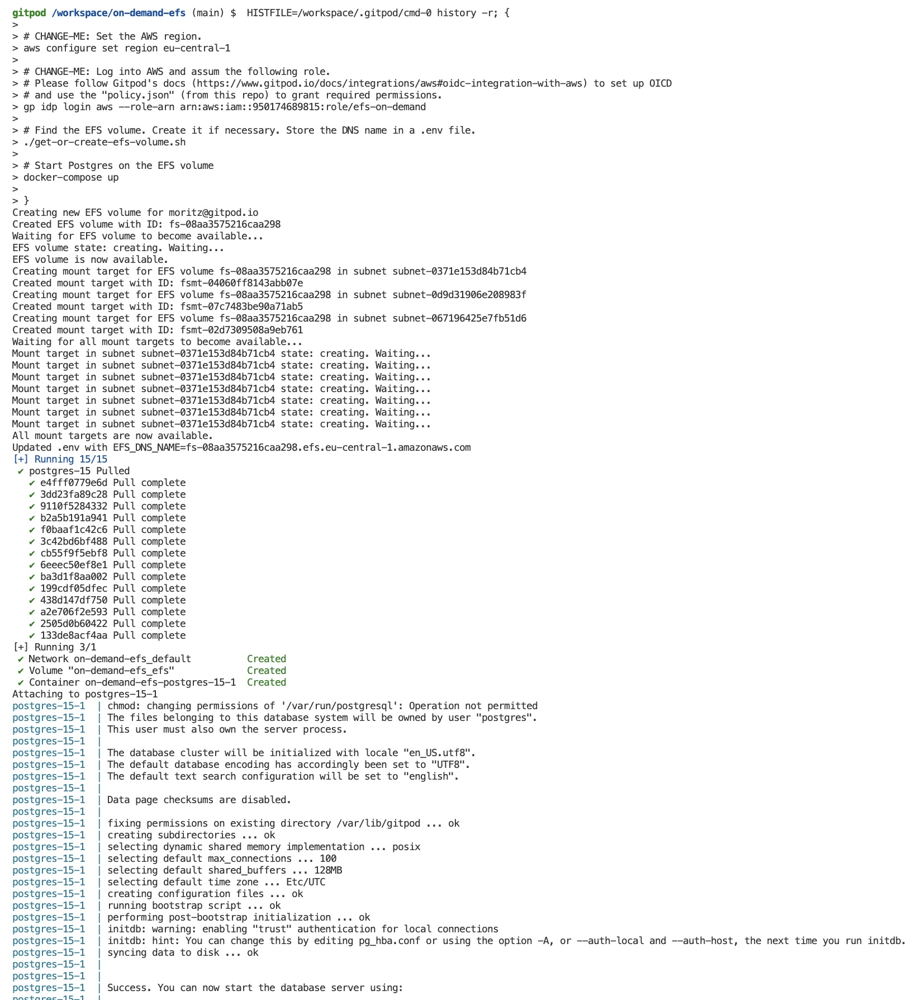
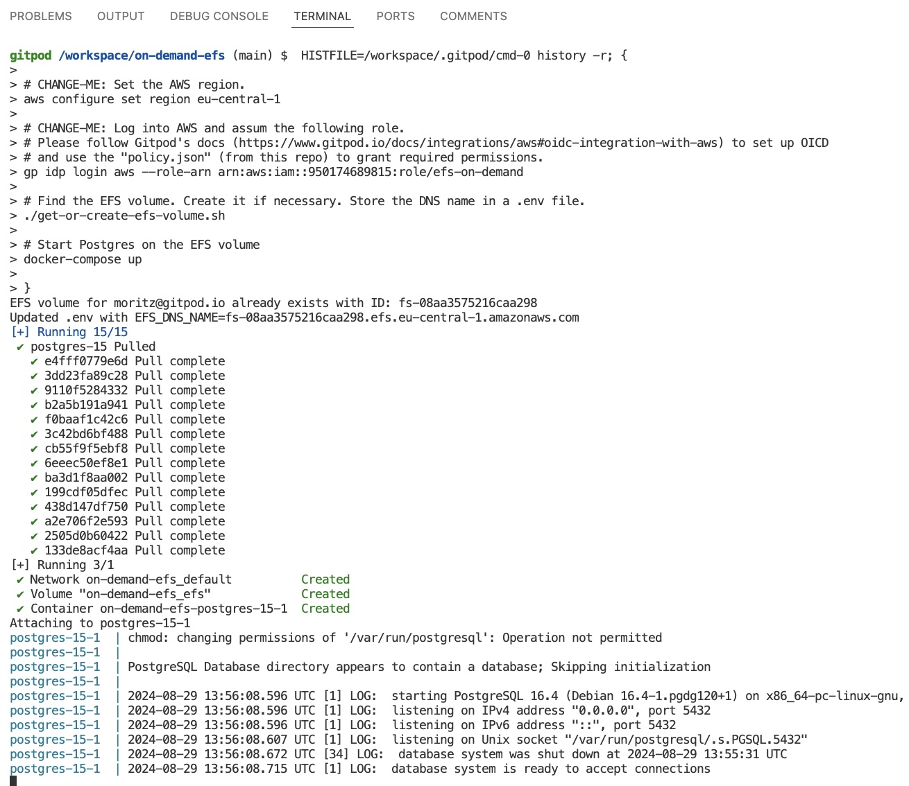

# on-demand-efs

This example starts a postgres database via docker compose on an EFS volume. 
The EFS volume is named after the user's email address. If no EFS volume exists, this example will create a new EFS volume. 

### Setup

To make this example work for your AWS org, change all settings that have a "CHANGE-ME" comment. 

### Workspace Start: Create new EFS Volume

The screenshot shows the expected terminal output when there is no EFS volume found on workspace start and thus this automation creates a new volume.

### Workspace Start: Use existing EFS Volume

The screenshot shows the expected terminal output when there is a EFS volume that is used (and no new EFS Volume is being created).

### Limitations

This example does not protect users from accidentially starting multiple workspaces and thus multiple postgres databases (one per workspace) on the same EFS volume.